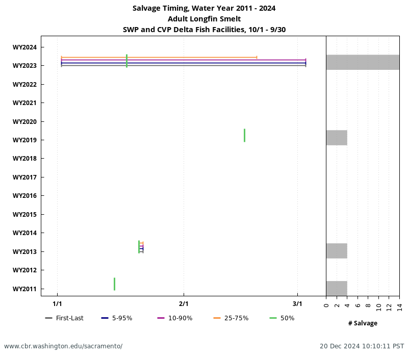
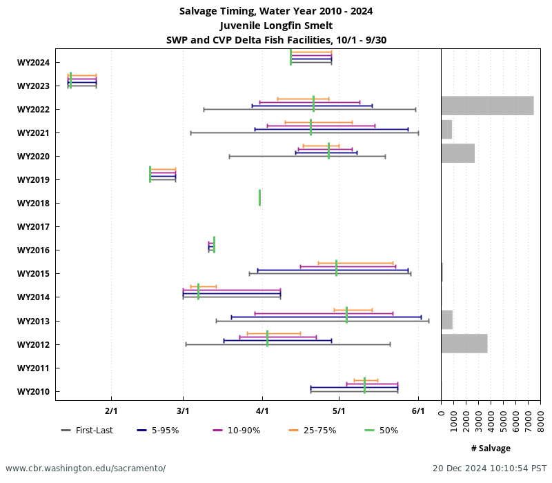

```{r setup, include=FALSE}
knitr::opts_chunk$set(message = FALSE, warning = FALSE)

library(here)
library(dplyr)
library(readr)
library(ggplot2)
library(janitor)
library(lubridate)
library(viridis)
```
## Notes on Processed Data

- Removed any row without a count, length, sample fraction
- Filtered to 2014-2025
- Assigned Life Stage (Adult > 84mm; Juvenile <= 84 mm)
- Cumulative Salvage represents fish count/sample fraction

## Notes

- There are very few instances of Adult Longfin Smelt Salvage
- Most salvage occurs in Drier Springs for Juvenile Longfin Smelt

```{r, include = FALSE}
lfs_salvage0 <- read_csv(here("data_raw/lfs_loss.csv")) 
lfs_salvage <- lfs_salvage0 %>%
  clean_names() %>%
  filter(!is.na(facility),
         !is.na(nfish),
         !is.na(length)) %>%
  mutate(sample_time = mdy_hm(sample_time),
         year = year(sample_time),
         month = month(sample_time),
         date = date(sample_time),
         wy = if_else(month>=10, year+1, year)) %>%
  filter(wy > 2013) %>%
  mutate(wy = as.factor(wy)) %>%
  mutate(date2 = case_when(month>=10 ~ ymd(paste0(1980, "-", month, "-", day(date))),
                           month<10 ~ ymd(paste0(1981,"-", month, "-", day(date) )))) %>%
  mutate(lifestage = if_else(length>84, "Adult", if_else(length>=19, "Juvenile", "Larva"))) %>%
  mutate(expanded = nfish/sample_fraction)%>%
  filter(!is.na(expanded)) %>%
  group_by(wy, lifestage) %>%
  arrange(date) %>%
  mutate(cumulative_salvage = cumsum(expanded)) %>%
  ungroup() %>%
  select(facility, date, length, wy, month, date2, lifestage, expanded, cumulative_salvage)
```


```{r, include = FALSE}
## Create data frame for 2025 (just one sample)

df_2025 <- data.frame(facility = "CVP", date = ymd("2024-12-18"),length = 114, wy = "2025",  month = 12,
                      date2 = ymd("1980-12-18"), lifestage = "Adult",expanded = 4) %>%
   mutate(cumulative_salvage = cumsum(expanded))
```


```{r, include = FALSE}
## Combine data frames

lfs_salvage_all <- bind_rows(lfs_salvage, df_2025) %>%
  mutate(current_year = if_else(wy == 2025, "Y", "N"))
```


\pagebreak
## Historical and Current Cumulative Salvage
```{r longfin-plot, echo = FALSE, fig.cap = "Longfin Smelt Salvage, WY 2014-2025. Data from SacPAS/CDFW.", fig.width = 9, fig.height = 6}
## Plot results
scaledf <- lfs_salvage_all[which(!duplicated(lfs_salvage_all$lifestage)),]
scaledf$cumulative_salvage <- c(0, 0)

(plot_salvage <- ggplot() +
  geom_point(data = scaledf, alpha = 0, aes(x = date2, y = cumulative_salvage)) + 
  geom_point(data=lfs_salvage_all, aes(x = date2, y = cumulative_salvage, color = wy, shape = wy, group = wy, size = current_year)) +
  geom_line(data=lfs_salvage_all, aes(x = date2, y = cumulative_salvage, color = wy, group = wy)) + 
  facet_wrap(~lifestage, nrow = 3, scales = "free_y")+
  scale_color_viridis(discrete = TRUE, option = "turbo")+
  labs(x = "Date", color = "Water Year", shape = "Water Year", y = "Cumulative LFS Salvage\n(expanded)", title = "Longfin Smelt Salvage\nWY 2014-2025") +
  scale_size_manual(values = c(1.6, 3)) +
  scale_shape_manual(values = c(25, 4, 1, 23, 19, 7, 23, 3, 15, 0, 8))+
  scale_x_date(date_labels = "%b") +
  theme_bw() +
  guides(size = "none") +
  theme(strip.text = element_text(size = 12),
        plot.title = element_text(hjust = 0.5)))
```

```{r, include = FALSE}
png(here("figures/lfs_cum_salvage_plot.png"), res = 300, width = 7, height = 5, units = "in")
plot_salvage
dev.off()
```
\pagebreak
## SacPAS Salvage Timing 






